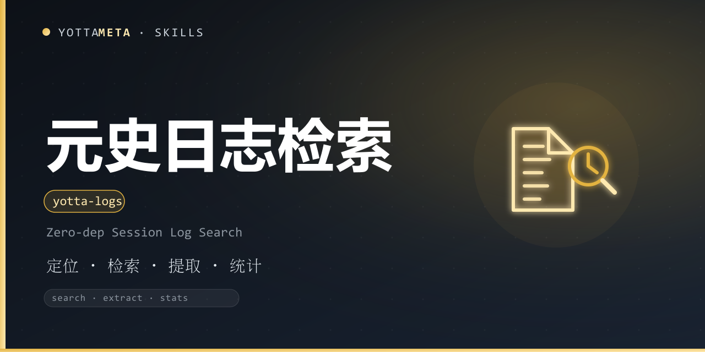

<p align="center">
  
</p>

<h1 align="center">yotta-logs · 元史</h1>

<p align="center">YottaMeta 自有的历史会话日志检索技能：<b>零依赖检索 / 分析会话 JSONL 记录</b>，回溯旧对话与父会话上下文，为跨会话追溯提供原始日志依据。适用于查以前说过的结论、定位某段决策、回顾某次讨论。</p>
<p align="center">用户引用先前聊过的内容 / 父会话 / 历史上下文时自动激活——<b>不依赖 jq / rg，纯标准库确定性检索</b>。</p>
<p align="center">纯 Python 3.8+ 标准库实现，零外部依赖；Windows + Linux + macOS 通用；只读本地日志，默认脱敏，不联网上传。</p>

<p align="center">
  <a href="LICENSE"></a>
  <a href="https://agentskills.io/"></a>
  <a href="https://www.npmjs.com/package/@yottameta/yotta-logs"></a>
  <a href="https://github.com/YottaMeta/yotta-logs"></a>
  <a href="https://github.com/YottaMeta/yotta-logs/commits/main"></a>
  <a href="https://github.com/YottaMeta/yotta-logs"></a>
</p>

## 这是什么

智能体每天产生大量会话日志（JSONL），跨会话追溯时最缺的不是「记得发生过」，而是「原文在哪、谁说的、什么时候说的」。元史把这些日志做成**确定性检索引擎**：定位会话日志目录 → 按关键词 / 正则 / 日期 / 会话 / 角色检索 → 提取会话原文 → 统计消息、token、成本与工具调用。

它不是某个平台的专属功能，而是一份与智能体无关的工具包：装进任何支持 Agent Skills 的智能体即可按需调用。全程零依赖、只读本地、不联网；输出默认脱敏，避免把日志里的密钥 / token 带到上下文。

## 核心价值

- **零依赖检索**：Python 3.8+ 标准库，不依赖 jq / rg / ripgrep 等外部工具，Windows + Linux + macOS 开箱即用。
- **容错解析**：JSONL 字段形态差异（message.content 为列表或字符串、role 在顶层或 message 内、toolResult / toolCall 命名差异）均可容忍；坏行自动跳过并计数，不中断检索。
- **默认脱敏**：输出自动打码疑似密钥 / token / 口令（sk-、ghp_、AKIA、JWT、Bearer、URL 口令、key=value 赋值、超长 token），--no-redact 关闭。
- **多维度过滤**：关键词（不区分大小写）/ 正则 / 日期 / 会话 ID / sessions.json 别名 / 角色（user / assistant / tool / system）。
- **结构化输出**：--json 输出纯净 JSON，含会话 ID、行号、时间戳、角色，适合程序化核对出处。
- **只读安全**：只读本地日志，不修改、不删除、不联网上传，与元忆（语义记忆）互补分工。

## 核心优势

| 优势 | 说明 |
|---|---|
| **零依赖** | Python 3.8+ 标准库，无模型、无数据库、无外部服务；Windows + Linux + macOS 通用 |
| **确定性** | 检索逻辑可复现、可解释；命中即原文片段 + 行号，不靠模型猜测 |
| **默认脱敏** | 疑似密钥 / token / 口令自动打码，降低日志原文外泄风险 |
| **容错** | 不同智能体的 JSONL 形态差异可容忍，坏行跳过不中断 |
| **定位准确** | 命中结果带会话 ID / 行号 / 时间戳 / 角色，可精确回溯出处 |
| **生态分发** | GitHub + npm + ClawHub 三源同步发布；npx / install.sh / 手动复制三种安装方式 |

## 功能体系

| 命令 | 说明 |
|---|---|
| locate | 自动发现本机常见的会话日志目录（Codex / Claude Code / Clawdbot 等） |
| scan | 列出目录下所有会话：ID / 日期 / 消息数 / 大小 / sessions.json 别名 |
| search | 跨会话检索：关键词 / 正则 + 日期 / 会话 / 角色过滤，输出时间线命中（--json 结构化） |
| session | 提取单个会话原文：时间线 + 角色 + 文本，--role 过滤，--tools 标注工具调用 |
| stats | 会话统计：消息 / 角色分布 / token / 成本 / 时间范围 / 每日汇总（--daily） |
| tools | 工具调用次数排行 |
| version | 打印版本 |

## 快速使用

Windows 用 python，Linux/macOS 用 python3。

```bash
# 自动发现本机常见会话日志目录
python3 scripts/yotta_logs.py locate

# 列出目录下所有会话
python3 scripts/yotta_logs.py scan --dir ~/.clawdbot/agents/<agentId>/sessions

# 跨会话检索关键词（时间线命中，默认脱敏）
python3 scripts/yotta_logs.py search "部署方案" --dir /path/to/sessions

# 正则 + 日期 + 会话过滤
python3 scripts/yotta_logs.py search "CI 失败" --regex --date 2026-08-26 --dir /path/to/sessions

# 提取单个会话原文
python3 scripts/yotta_logs.py session abc123 --dir /path/to/sessions

# 统计（消息 / token / 成本 / 每日汇总）
python3 scripts/yotta_logs.py stats --dir /path/to/sessions --daily

# 工具调用排行
python3 scripts/yotta_logs.py tools --dir /path/to/sessions

# JSON 结构化输出（适合程序化核对）
python3 scripts/yotta_logs.py search "部署方案" --dir /path/to/sessions --json
```

退出码语义（与元安 / 元审 / 元盾 / 元真家族一致）：0 = 成功；1 = 无匹配 / 空结果集；4 = 用法错误 / 致命异常。

未指定 --dir 时，依次尝试环境变量 YOTTA_LOGS_DIR → 自动定位首个已知日志目录；找不到则退出码 4 并提示。

## 安装

三种方式任选其一，技能文件统一从 **npm** 获取（GitHub 无代理时较慢，npm 可配国内镜像加速）。

### 方式一：npm（推荐，一行安装）
```bash
# 国内加速（可选）：npm config set registry https://registry.npmmirror.com
npx -y @yottameta/yotta-logs -g
npx -y @yottameta/yotta-logs --dir <你的技能目录>   # 任意智能体：指定目录安装
```
> 智能体不在预置列表里？用 --dir 指定它的 skills 目录，或手动复制（方式三）。--list 可查看各智能体对应的默认目录。想手动拿文件也可 npm pack @yottameta/yotta-logs 解包后按方式二/三安装。

### 方式二：install.sh 一键安装
获取技能文件夹后（npm pack 解包或 git clone），进入技能文件夹：
```bash
bash install.sh -g    # 用户级；bash install.sh --list 查看全部目录
bash install.sh --agent codex   # 指定智能体（--list 可查看可用项）
bash install.sh       # 项目级：自动检测已存在的 .claude/.cursor/.codex 等 skills 目录
bash install.sh --dir /path/to/skills
```
> 覆盖 17 类智能体，含国内 Trae / Qwen / Comate / CodeBuddy / Kimi。Windows 用户：装有 Git Bash 即可用；否则用方式三手动复制。

### 方式三：手动复制
把整个 yotta-logs 文件夹复制到目标智能体的 skills 目录。常见位置（用户级；Windows 用 %USERPROFILE%，Linux/macOS 用 ~）：

| 智能体 | 用户级目录 | 项目级目录 |
|---|---|---|
| Codex | %USERPROFILE%\.codex\skills\yotta-logs\ | .codex\skills\ |
| Claude Code | %USERPROFILE%\.claude\skills\yotta-logs\ | .claude\skills\ |
| Cursor | %USERPROFILE%\.cursor\skills\yotta-logs\ | .cursor\skills\ |
| Windsurf | %USERPROFILE%\.codeium\windsurf\skills\yotta-logs\ | .windsurf\skills\ |
| opencode | %USERPROFILE%\.config\opencode\skills\yotta-logs\ | .opencode\skills\ |
| Gemini | %USERPROFILE%\.gemini\skills\yotta-logs\ | .gemini\skills\ |
| Goose | %USERPROFILE%\.config\goose\skills\yotta-logs\ | .goose\skills\ |
| Amp | %USERPROFILE%\.config\agents\skills\yotta-logs\ | .agents\skills\ |
| Kiro | %USERPROFILE%\.kiro\skills\yotta-logs\ | .kiro\skills\ |
| WorkBuddy | %USERPROFILE%\.workbuddy\skills\yotta-logs\ | .workbuddy\skills\ |
| Trae Code CLI | %USERPROFILE%\.traecli\skills\yotta-logs\ | .traecli\skills\ |
| Trae IDE（国内） | %USERPROFILE%\.trae-cn\skills\yotta-logs\ | .trae\skills\ |
| Qwen Code | %USERPROFILE%\.qwen\skills\yotta-logs\ | .qwen\skills\ |
| Comate | %USERPROFILE%\.comate\skills\yotta-logs\ | .comate\skills\ |
| CodeBuddy | %USERPROFILE%\.codebuddy\skills\yotta-logs\ | .codebuddy\skills\ |
| Kimi | %USERPROFILE%\.kimi\skills\yotta-logs\ | .kimi\skills\ |
| 通用 AGENTS.md | %USERPROFILE%\.agents\skills\yotta-logs\ | .agents\skills\ |

> Codex 默认目录若设置了环境变量 CODEX_HOME，以该变量为准；opencode 若设置 XDG_CONFIG_HOME 同理。.agents\skills 并非通用目录，仅 OpenCode / Cursor / Cline / Amp / Kimi / Gemini CLI / GitHub Copilot 等会读取，Claude Code 与 Codex 默认不读。不确定时用 --dir 指定，或让该智能体自行安装。

## 使用示例（AI 智能体）

1. 将本仓库的 SKILL.md 接入任意 AI 智能体的技能/规则系统（见上方安装）。
2. 用户问「上次说的部署方案是什么」时，先定位并检索：
   ```bash
   python3 scripts/yotta_logs.py locate
   python3 scripts/yotta_logs.py search "部署方案" --dir <日志目录>
   ```
   得到命中时间线（会话 / 时间 / 角色 / 原文片段）。
3. 需要完整上下文时提取对应会话：
   ```bash
   python3 scripts/yotta_logs.py session <会话ID> --dir <日志目录>
   ```
4. 需要精确出处时用 --json 拿会话 ID / 行号 / 时间戳，回答时给出依据。
5. 需要回顾某次会话成本或工具使用分布时用 stats / tools。

## 开发与校验

- 测试：python scripts/test_yotta_logs.py（75 项）
- 基础校验：python tools/validate-skill.py yotta-logs（在仓库根目录运行）
- CLI 协议：references/cli.md；日志格式：references/format.md；安全边界：references/security.md

## 许可证

MIT © YottaMeta —— 详见 [LICENSE](./LICENSE)。
